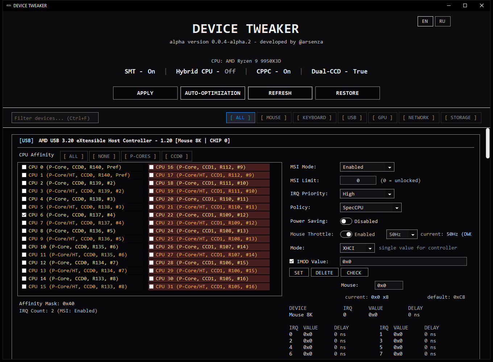
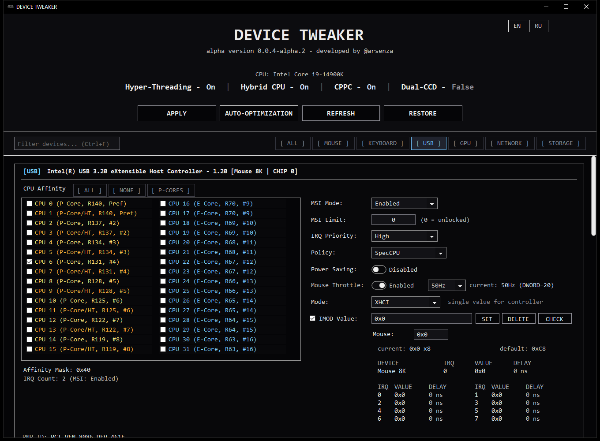
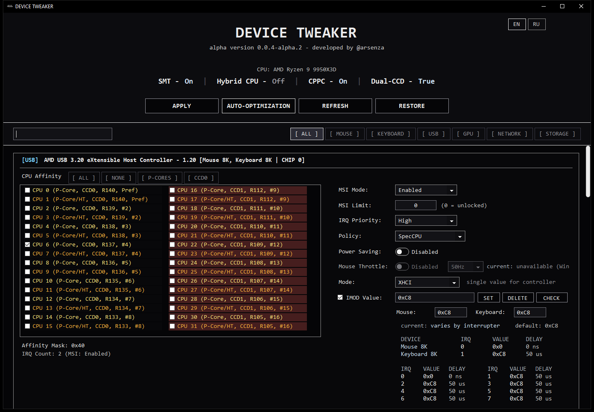
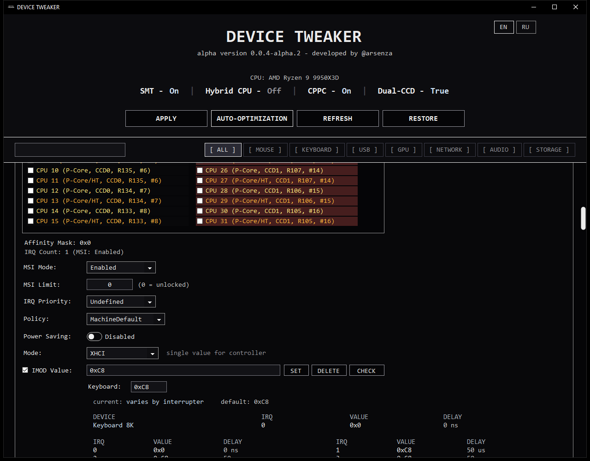
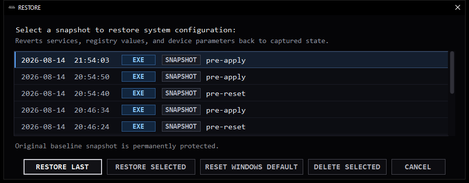

# DEVICE TWEAKER

[](https://github.com/arsenzaaa/DEVICE-TWEAKER/releases)
[](./LICENSE)
[](https://t.me/arsenzaa)

[Русский](./README.md) | **English**

---

**DEVICE TWEAKER** is a low-level systems engineering utility for 64-bit Windows 10 and Windows 11, designed for configuring hardware interrupts (MSI / MSI-X), processor topology-aware DPC/ISR queue steering (Interrupt Affinity) across modern CPU architectures (Intel Hybrid, AMD Multi-CCD), direct physical MMIO register programming of moderation timers (xHCI IMOD / NIC ITR), and operating system core isolation.

The program includes a custom signed Ring 0 kernel driver (`DTIMOD.sys`) for direct MMIO register access and an atomic differential checkpoint engine for configuration recovery.

---

<p align="center">
  
</p>

---

## Features & Capabilities

### 1. Hardware Interrupts: MSI / MSI-X (Message Signaled Interrupts)
DEVICE TWEAKER converts peripheral PCIe controllers from legacy pin assertions (Line-based / INTx) to MSI / MSI-X vector mode. Under vector mode, interrupt delivery is executed via atomic PCIe Memory Write transactions directed straight to the target core's Local APIC address space (`0xFEE00000`):
- **Enable Vector Mode (`MSISupported = 1`):** switches USB host controllers, GPUs, NVMe controllers, and network adapters to MSI mode, eliminating shared IRQ line contention.
- **Vector Limit Unclamp (`MessageNumberLimit = 0` / Unlocked):** by default, Windows often restricts driver vector allocations to 1 or 4. Setting Unlocked mode removes `MessageNumberLimit` from the registry, enabling `pci.sys` to allocate the full hardware MSI-X vector pool (up to 2048 vectors) requested by the controller.
- **HAL Interrupt Priority (`DevicePriority`):** elevates interrupt dispatch priority for latency-sensitive controllers (mouse input, GPU) inside the Windows HAL arbiter.

---

### 2. Processor Interrupt Steering (Interrupt Affinity)
Default Windows policies distribute hardware interrupts and DPCs across all cores without accounting for asymmetric microarchitectures. DEVICE TWEAKER configures `DevicePolicy = 4` (`IrqPolicySpecifiedProcessors`) and the 64-bit `AssignmentSetOverride` bitmask with native processor topology awareness:

#### Intel Core Hybrid Architecture (P-Cores vs E-Cores)
On Intel Core 12th-14th Gen and Core Ultra processors (Alder Lake, Raptor Lake, Arrow Lake), cores are divided into Performance Cores (P-Cores) and Efficient Cores (E-Cores, clustered in 4-core groups sharing an L2 cache at lower clock speeds).
- **Hardware Pathology:** high-frequency mouse interrupts (1000-8000 Hz), GPU render completion signals, or network receive queues landing on slower E-cores cause cross-core synchronization stalls, thread preemption, and frametime jitter.
- **Software Solution:** DEVICE TWEAKER detects hybrid topology (`Hybrid CPU - On`), segregates logical processors, and exposes the **`[ P-CORES ]`** button to exclude all E-cores and Hyper-Threading sibling threads from interrupt servicing in one click.

<p align="center">
  
</p>

#### AMD Ryzen Multi-CCD Architecture (Dual-CCD / 3D V-Cache)
On multi-die AMD Ryzen processors (7900X, 7950X, 7950X3D, 9900X, 9950X, 9950X3D), cores reside on two distinct silicon dies (CCD0 and CCD1) interconnected via Infinity Fabric.
- **Hardware Pathology:** local L3 cache access within the same die incurs roughly 20 ns, whereas transactions to the adjacent die over Infinity Fabric carry a 70-90 ns latency penalty. On 3D V-Cache models, the high-density 96 MB L3 cache resides physically on CCD0 only.
- **Software Solution:** DEVICE TWEAKER detects multi-die layouts (`Dual-CCD - Yes`), visually highlights CCD1 secondary cores, and anchors latency-critical queues (mouse, GPU) to the primary die via **`[ CCD0 ]`**, preserving working set residency within the game's local L3/3D V-Cache domain.

<p align="center">
  
</p>

#### Hardware Silicon Quality Binning (ACPI CPPC2)
The software natively reads factory silicon quality rankings via the Windows ETW kernel event logger (provider `Microsoft-Windows-Kernel-Processor-Power`, Event ID 55, field `MaximumPerformancePercent`). This executes in under 60 ms and enables binding high-frequency mouse controllers to the highest-binned physical core without external tools.

---

### 3. Direct Hardware xHCI IMOD Moderation (DTIMOD.sys Driver)
Per Intel xHCI Specification Revision 1.2 (§5.5.2), each hardware interrupter implements a 32-bit `IMOD` register. The lower 16 bits (`IMODI`) specify the moderation interval in 250-nanosecond hardware clock increments. By default, the Windows `USBXHCI.SYS` driver enforces delays of 50 µs (`0xC8`) or 1 ms (`0xFA0`) for packet batching:
- **Disable Moderation (`IMOD = 0` / 0x0):** the controller asserts a PCIe bus interrupt immediately upon completion of each packet transfer (Event TRB), eliminating artificial buffering on mouse ports.
- **Signed Ring 0 Driver (`DTIMOD.sys`):** directly reads and writes physical MMIO registers through `MmMapIoSpace`. It operates cleanly under Hypervisor-Protected Code Integrity (HVCI / Memory Integrity) and Microsoft VulnerableDriverBlocklist, remaining trusted by modern anti-cheats (Vanguard, EAC, BattlEye).
- **CHIP 0 / CHIP 1 Bus Differentiation:** the `UsbChipPath` engine analyzes the PCIe bus tree to distinguish direct CPU Root Complex controllers (CHIP 0 / Direct PCIe Lanes) from chipset hubs (CHIP 1 / PCH). This allows applying zero moderation (`0x0`) on the mouse controller while preserving safe buffers (1 ms / `0xFA0`) on chipset audio interfaces to prevent stream underruns and audio popping.

<p align="center">
  
</p>

---

### 4. Network Subsystem: NIC ITR Registers & Receive Side Scaling (RSS)
- **Direct MMIO Programming of NIC Moderation Timers:** via `DTIMOD.sys`, the utility reads and modifies physical hardware interrupt moderation registers:
  - Intel PCIe (EITR / ITR): I225, I226, I210, I211, I350, I219, 82580, 82576, and Killer E3100 (MMIO offsets `0x1680` and `0x00C4` with 1-2 µs quantum).
  - Realtek PCIe (IntrMit / IntrMitV2): RTL8111, RTL8168, RTL8125, RTL8126, and Killer E2500/E2600 (registers `0x00E2` and `0x0A00` with per-queue mask `0x7F7F7F7F`).
- **Receive Side Scaling (RSS):** granular configuration of `*NumRssQueues` and `*RssBaseProcNumber` under the network adapter registry key. Restricting queues and steering them away from CPU 0 prevents network DPCs from contending with the mouse input pipeline and game loop.
- **Power Management Configuration:** disables PCIe D3 low-power states (`PnPCapabilities` bit `0x08`, synchronized via WMI `MSPower_DeviceEnable`) and disables USB Selective Suspend.

---

### 5. Kernel Thread Scheduler Reservation (ReservedCpuSets)
Configures `[HKLM\SYSTEM\CurrentControlSet\Control\Session Manager\kernel] ReservedCpuSets`. The 64-bit bitmask excludes specified logical processors from the generic scheduler pool (`KiSelectNextThread`). Windows system services and unpinned background threads are barred from executing on reserved cores, preserving execution pipelines and cache lines exclusively for affinity-bound processes and dedicated interrupts.

---

### 6. Background Input Throttling (Windows 11 RawMouseThrottleDuration)
Configures `HKCU\Control Panel\Mouse\RawMouseThrottleDuration` (introduced in Windows 11 Build 22621.1928 / KB5028185). Allows configuring raw input reporting intervals (1 to 20 ms) for unfocused and occluded background windows, eliminating unnecessary CPU interrupt overhead caused by 1000-8000 Hz mice in background applications (Discord, OBS, web browsers) without impacting the active game window.

---

### 7. Differential Checkpoints & Crash Protection
- **Immutable Initial Baseline:** automatically captures and write-protects a pristine system snapshot upon first launch (`DeviceTweakerBackup_ORIGINAL.json`).
- **Pre-Action Checkpoints:** atomically records modified state prior to every APPLY, reset, or IMOD/ITR write. The program automatically rolls back changes if a registry write error occurs.
- **1-Click Recovery:** provides granular rollback to the latest working point or complete restoration to pristine Windows factory defaults.

<p align="center">
  
</p>

---

## System Requirements & Building from Source

### System Requirements
- **Operating System:** Windows 10 (Build 19041 and newer) / Windows 11 (64-bit).
- **Architecture:** x86-64.
- **Privileges:** Administrator privileges required for registry configuration, Local APIC parameters, and Ring 0 driver MMIO mapping.

### Deliverables
- **`DEVICE.TWEAKER.exe`** (~4 MB) - compact binary, requires [.NET 8 Desktop Runtime](https://dotnet.microsoft.com/download/dotnet/8.0).
- **`DEVICE.TWEAKER.SelfContained.exe`** (~150 MB) - autonomous binary with bundled .NET 8 runtime, ready to run on clean systems without dependencies.

### Building from Source
Requires the [.NET 8.0 SDK](https://dotnet.microsoft.com/download/dotnet/8.0).

Building both application flavors with release packaging and SHA-256 manifest generation:

```powershell
powershell -ExecutionPolicy Bypass -File ".\publish-variants.ps1" -Flavor both
```

Compiled deliverables and the `SHA256SUMS.txt` manifest are placed in:
```
.\bin\ReleasePackages\v0.0.4-alpha.2\
```

---

## License & Contact

- **Author:** [@arsenza](https://t.me/arsenzaa)
- **Channel & Support:** [Telegram @arsenzaa](https://t.me/arsenzaa)
- **License:** [GNU General Public License v3.0](./LICENSE)
