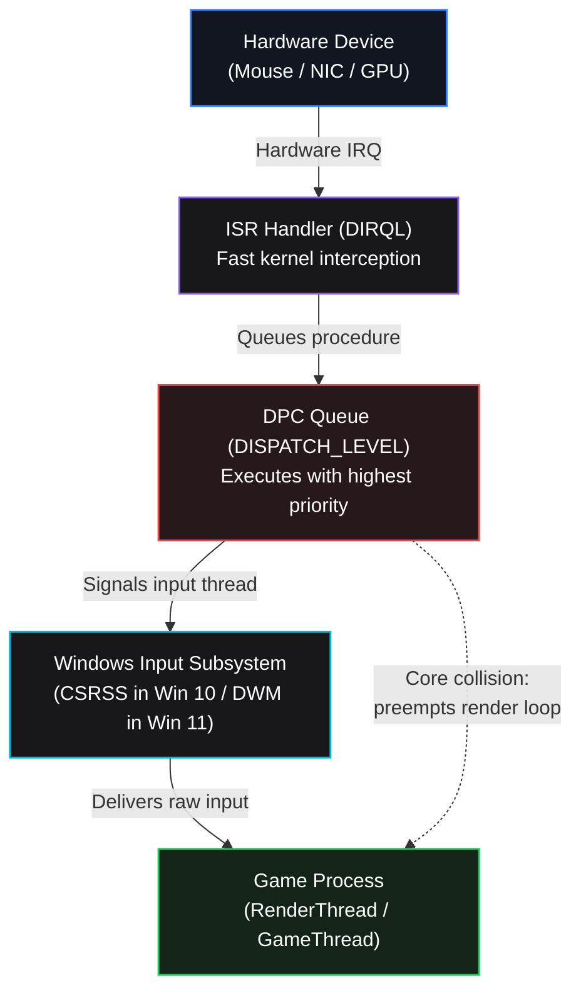

<div align="center">


<br><br>

[](https://github.com/arsenzaaa/DEVICE-TWEAKER/releases)
[](https://github.com/arsenzaaa/DEVICE-TWEAKER)
[](https://github.com/arsenzaaa/DEVICE-TWEAKER)
[](LICENSE)
[](https://t.me/arsenzaa)

<p align="center">
  <a href="./README.md">Русский</a> • <b>English</b>
</p>

---

<br>


</div>

<br>

**DEVICE TWEAKER** is a Windows 10 and 11 utility for comprehensive configuration of device interrupts (MSI), core affinity routing (CPU Affinity), direct USB interrupt moderation (xHCI IMOD), and network stack tuning.

It combines into a single interface everything that previously required scattered tools and manual registry edits: switching devices to MSI / MSI-X mode, removing vector limits, pinning interrupts to specific cores according to CPU architecture, reading and writing USB IMOD registers directly via our custom kernel driver `DTIMOD.sys`, configuring network queues (RSS / NIC ITR), and reserving CPU cores via `ReservedCpuSets`.

---

## Comparison: Default Windows vs DEVICE TWEAKER

| Parameter | Default Windows Configuration | With DEVICE TWEAKER Optimization |
| :--- | :--- | :--- |
| **Interrupt Queues** | Congested on `CPU 0` alongside the system timer and disk I/O | GPU, mouse, and network partitioned across dedicated physical cores without collisions |
| **USB IMOD (Moderation)** | Controller delays interrupts by ~50 μs, batching packets in buffers | **`0 μs` (Zero Moderation)** — mouse reports delivered to the CPU immediately |
| **Network Stack** | Network interrupts compete with mouse input inside shared `WDF01000.sys` | Dedicated **RSS** queues on isolated cores and disabled **`NIC ITR = 0`** |
| **AMD Ryzen X3D CPUs** | Device interrupts arbitrarily land on CCD1, incurring Infinity Fabric latency | All latency-sensitive devices pinned to the fast **CCD0 (3D V-Cache)** |
| **Intel Hybrid CPUs** | Interrupts can execute on slower efficiency cores (E-Cores) | Complete E-Core exclusion, interrupts pinned to dedicated **P-Cores** |
| **Background OS Services** | Windows scheduler assigns background tasks to any free core | **`ReservedCpuSets`** shields optimized cores from background operating system noise |

---

## Interrupt & Latency Pipeline



### Why Micro-Stutters Happen Without Proper Configuration:

- **Game Thread Preemption:**  
  DPC queues execute at `DISPATCH_LEVEL`, which strictly supersedes user-mode game execution. When interrupts from a high-polling mouse (1000–8000 Hz) or network card are processed on the same core where the game renders frames, the game thread is forcibly preempted, creating micro-stutters and irregular frame times.
- **CPU 0 Overload:**  
  By default, Windows directs system timers, disk operations, and general device interrupts to core 0. Leaving graphics or input controllers on CPU 0 forces their queues into shared system traffic.
- **Hardware USB Moderation (xHCI IMOD):**  
  USB host controllers enable interrupt moderation (~50 μs) by default. The controller intentionally holds back interrupts to batch incoming packets. For high-polling gaming mice, this introduces delivery jitter. `DTIMOD.sys` writes directly to physical controller registers to set moderation to `0 μs` (zero delay).
- **Cross-CCD Latency on AMD (Infinity Fabric):**  
  On AMD Ryzen dual-CCD processors (such as 7950X3D, 9950X3D), the game runs on CCD0 with the fast 3D V-Cache. If GPU or peripheral interrupts execute on CCD1, data is constantly routed through the Infinity Fabric interconnect, adding 60–80 ns of round-trip latency.
- **Slow E-Cores on Intel:**  
  On Intel 12–14th Gen processors, latency-critical interrupts should not be assigned to efficiency cores (E-Cores) due to their narrower pipeline and slower wake-up times.
- **Mouse and Network Collisions:**  
  When the network card and mouse share the same core, heavy network traffic saturates the `WDF01000.sys` DPC queue, causing mouse packets to wait in line. Network traffic should be moved to separate cores via RSS queues, with network moderation disabled (`NIC ITR = 0`).
- **Why `ReservedCpuSets` Matters:**  
  This is a Windows registry setting (`HKLM\...\Session Manager\kernel`) that instructs the OS scheduler not to schedule background services and unpinned threads on selected cores. We reserve cores to shield them from background system noise.

---

## Core Capabilities

<table>
  <tr>
    <td width="50%" valign="top">
      <h3>⚡ MSI / MSI-X Mode</h3>
      <p>Transition devices from legacy line-based interrupts to Message Signaled Interrupts, remove message vector limits (<code>MessageNumberLimit</code>), and enforce <code>IRQ Priority = High</code>.</p>
    </td>
    <td width="50%" valign="top">
      <h3>🎯 CPU Affinity Routing</h3>
      <p>Topology-aware physical core routing respecting SMT / Hyper-Threading pairs, AMD chiplets (CCD0 with 3D V-Cache vs CCD1), and Intel Performance (P-Core) vs Efficiency (E-Core) cores.</p>
    </td>
  </tr>
  <tr>
    <td width="50%" valign="top">
      <h3>⏱ Direct USB IMOD Control</h3>
      <p>Zero moderation (<code>0 μs</code>) configuration via the custom <code>DTIMOD.sys</code> kernel driver at 250 ns precision. Per-interrupter tuning for mouse controllers and audio stability.</p>
    </td>
    <td width="50%" valign="top">
      <h3>🌐 Network Stack Tuning</h3>
      <p>Partition Receive Side Scaling queues across dedicated cores (<code>*NumRssQueues</code>, <code>*RssBaseProcNumber</code>) and disable interrupt moderation (<code>NIC ITR = 0 / Off</code> for Intel and Realtek).</p>
    </td>
  </tr>
  <tr>
    <td width="50%" valign="top">
      <h3>🚀 1-Click Auto-Optimization</h3>
      <p>Automated heuristic configuration: unburdening <code>CPU 0</code>, separating mouse and network queues, pinning the GPU to adjacent P-Cores, and locking interrupts to CCD0 on AMD X3D.</p>
    </td>
    <td width="50%" valign="top">
      <h3>🛡 State Protection & Safety</h3>
      <p>Mandatory automated backup generation before any write, write-protected factory snapshot (<strong>ORIGINAL STATE</strong>) that is never overwritten, and instant atomic rollback on write failures.</p>
    </td>
  </tr>
</table>

---

<details>
<summary><b>📸 Screenshots & Core Affinity Layouts (Click to expand)</b></summary>
<br>

### 1. Core Allocation: AMD Ryzen Dual-CCD (CCD0 with 3D V-Cache vs CCD1)
<p align="center">
  
</p>

### 2. Core Allocation: Intel Hybrid (P-Core / E-Core)
<p align="center">
  
</p>

### 3. USB xHCI IMOD Register Table (250 ns quantum)
<p align="center">
  
</p>

### 4. Backups and Factory Snapshot Restore (ORIGINAL STATE)
<p align="center">
  
</p>

</details>

---

## Hardware Compatibility

| Component | Tested & Supported Hardware |
| :--- | :--- |
| **Processors** | • **AMD Ryzen:** Zen 2 / 3 / 4 / 5 (including 3D V-Cache models: 7800X3D, 7900X3D, 7950X3D, 9800X3D, 9950X3D)<br>• **Intel Core:** 10th through 14th Gen (Core i5 / i7 / i9 with heterogeneous P-Core / E-Core layouts) |
| **Network Adapters** | • **Intel Ethernet:** I210, I211, I225-V, I225-LM, I225-K, I225-I, I226-V, I226-LM, I350<br>• **Realtek:** PCIe GbE Family Controller, 2.5GbE Gaming Family Controller |
| **USB Controllers** | xHCI compliant controllers for USB 3.0 / 3.1 / 3.2 / USB4 (AMD B450, B550, X570, B650, X670, X870 and Intel B660, Z690, B760, Z790 chipsets) |

---

## Driver & Safety Architecture

- **Driver-Free Polling:** The **REFRESH** button queries devices using standard Windows SetupAPI and registry hives without loading the kernel driver.
- **Kernel Driver `DTIMOD.sys`:** Loaded via KDU only when clicking **CHECK** or writing IMOD values. The driver remains resident until reboot to prevent kernel instability from dynamic driver unloading.
- **Reboot:** Interrupt parameters are read by Windows during device initialization, so a system reboot is required after clicking **APPLY**.
- **Logging:** Structured logs are written to the `logs` folder alongside the executable on every launch.

---

## Build Variants & Requirements

- **OS:** Windows 10 or Windows 11 (64-bit, all editions).
- **Available Builds:**
  - `DEVICE.TWEAKER.exe` (~4 MB) — standard version, requires [.NET 8 Desktop Runtime](https://dotnet.microsoft.com/download/dotnet/8.0).
  - `DEVICE.TWEAKER.NET.FRAMEWORK.exe` (~150 MB) — standalone self-contained build with embedded .NET 8 runtime (runs out of the box on clean Windows installations).

---

## Building from Source

Compilation requires the [.NET 8.0 SDK](https://dotnet.microsoft.com/download/dotnet/8.0).

Build both application variants and generate SHA-256 checksums with a single command from the repository root:

```powershell
powershell -NoProfile -ExecutionPolicy Bypass -File ".\DEVICE TWEAKER\build.ps1" -Flavor both -Configuration Release -SkipImodDriverBuild
```

Compiled binaries and checksum files will be in `DEVICE TWEAKER\bin\ReleasePackages\<version>\`.

---

## Automated Test Suite

The repository includes a suite of **21 unit tests (xUnit)** validating processor topology parsing, ETW CPPC event deserialization, affinity bitmasks, `ReservedCpuSets` formatting, and IMOD register bounds:

```powershell
dotnet test ".\DEVICE TWEAKER\tests\DeviceTweaker.Tests\DeviceTweaker.Tests.csproj" -c Release -p:BuildImodDriver=false
```

---

## Repository Layout

```
DEVICE-TWEAKER/
├── .gitignore
├── LICENSE
├── README.md                      # Documentation (Russian)
├── README.en.md                   # Documentation (English)
└── DEVICE TWEAKER/                # Application source code & assets
    ├── Core/                      # Services, backup and restore engine
    ├── Devices/                   # PCI, USB controller, and NDIS discovery
    ├── GUI/                       # WinForms interface and dialog forms
    ├── IMOD/                      # DTIMOD.sys physical MMIO driver and KDU
    ├── Interop/                   # P/Invoke wrappers for Win32 API
    ├── Localization/              # Interface language catalogs (RU / EN)
    ├── Models/                    # Data models, topologies, and reports
    ├── Tweaks/                    # Auto-tuning heuristics
    ├── Scripts/                   # Automation and validation scripts
    ├── tests/                     # DeviceTweaker.Tests xUnit test suite
    ├── assets/                    # Graphical assets, icons, and screenshots
    ├── docs/                      # Documentation & release archives
    ├── DeviceTweakerCS.csproj     # .NET 8 project definition
    └── build.ps1                  # Automated build script
```

---

## Author & Community

- **Author:** [@arsenzaa](https://t.me/arsenzaa)
- **GitHub:** [arsenzaaa](https://github.com/arsenzaaa)
- **Repository:** [DEVICE-TWEAKER](https://github.com/arsenzaaa/DEVICE-TWEAKER)

## License

This project is licensed under the [GNU General Public License v3.0](LICENSE).  
KDU components in `IMOD/KDU` are distributed under the MIT license.
