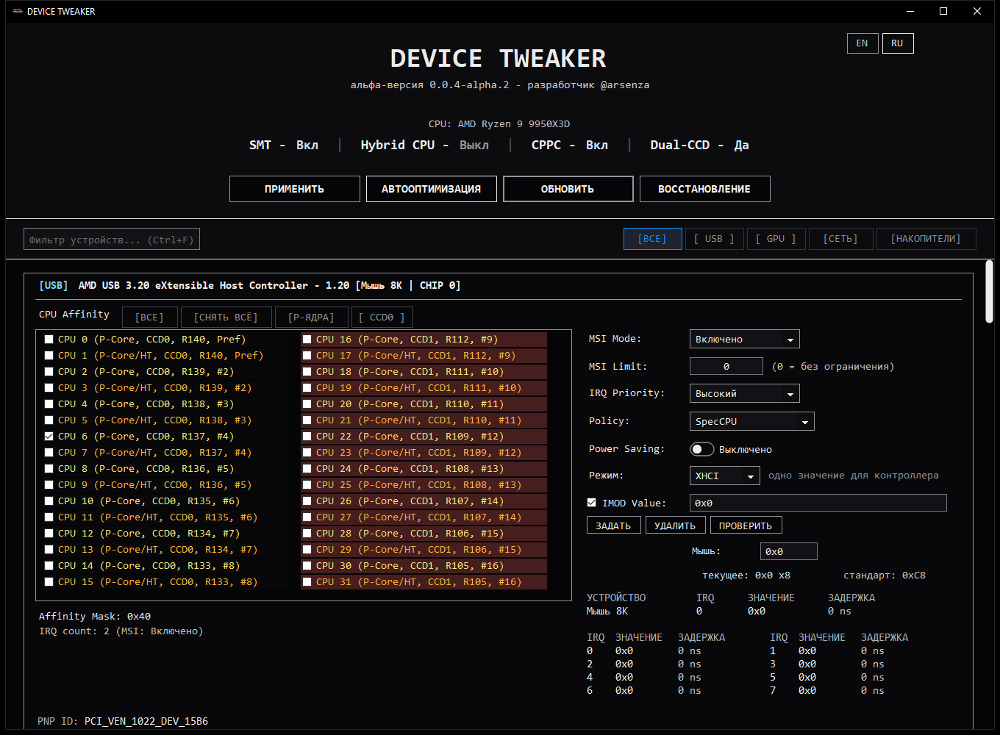
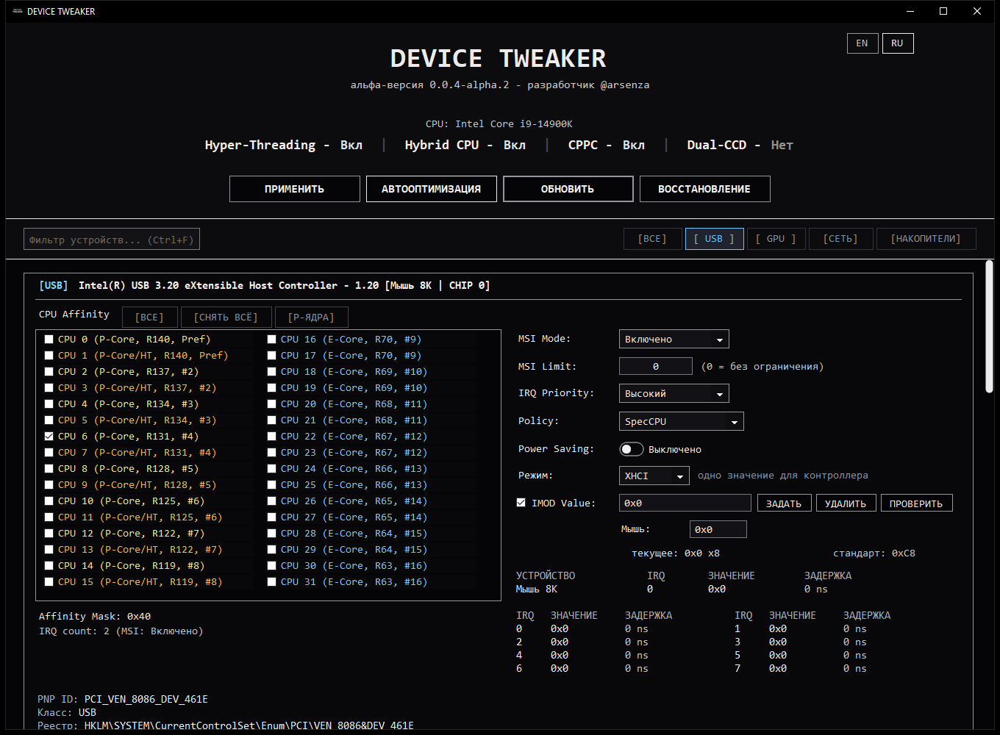
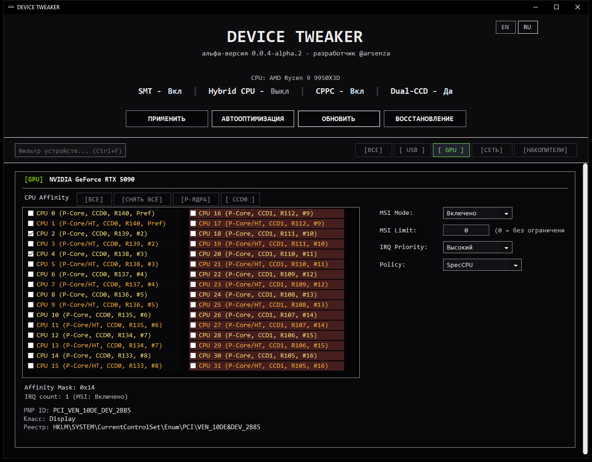
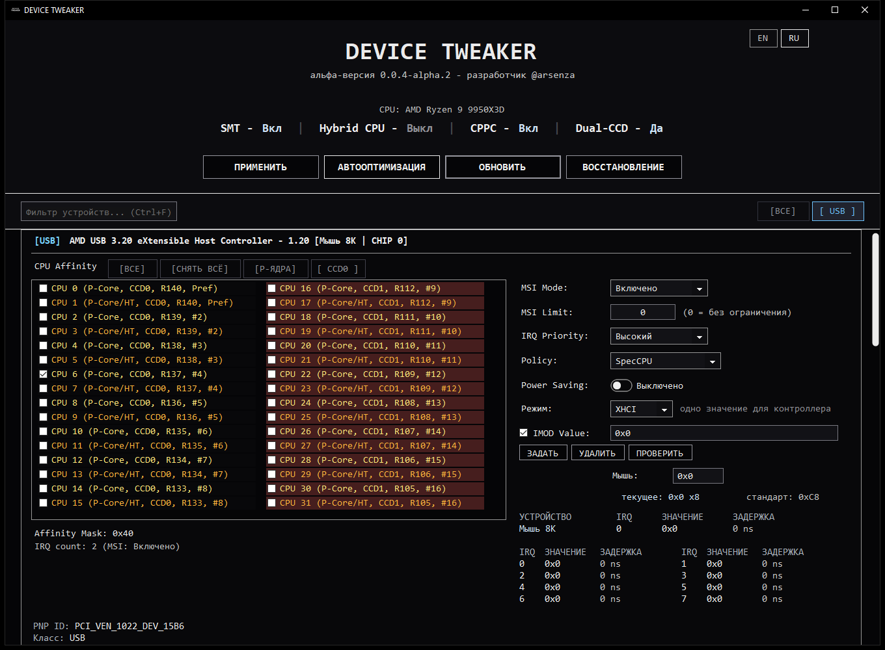
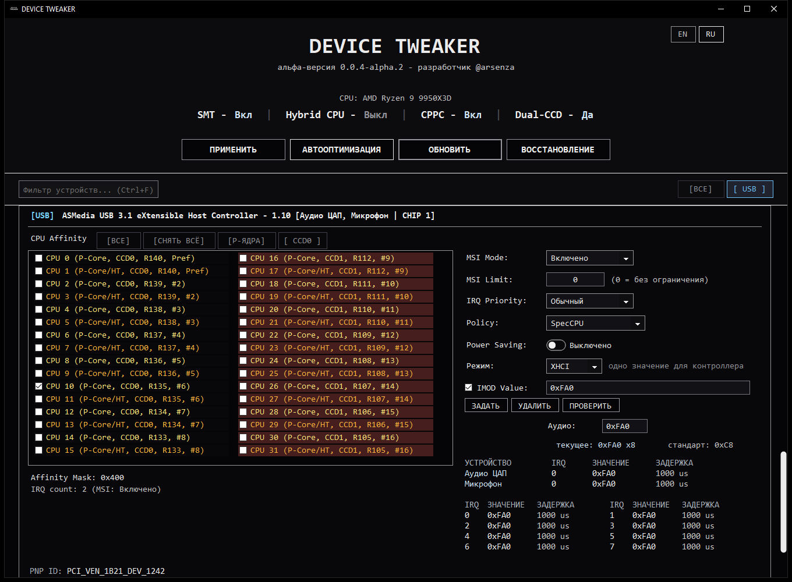
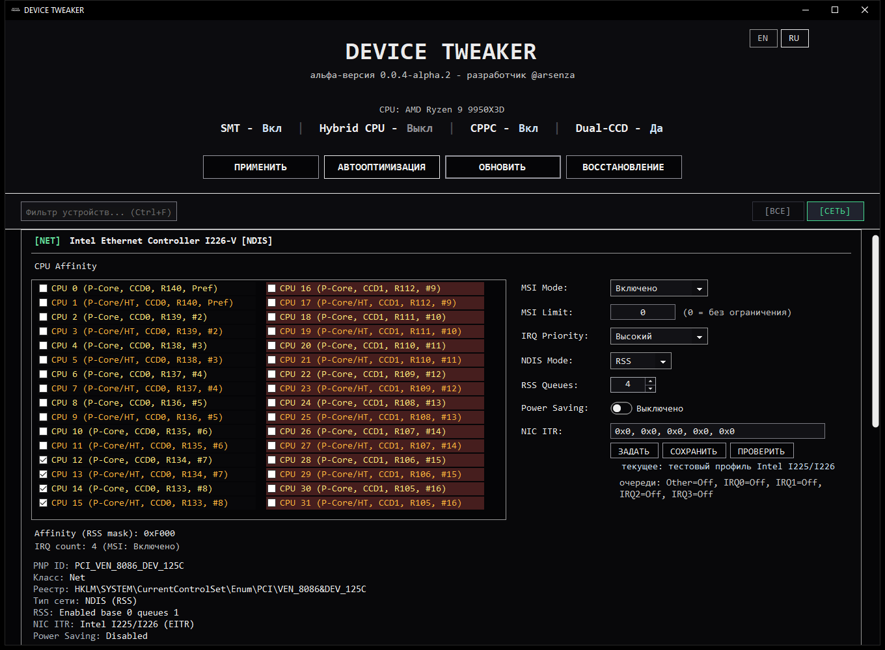
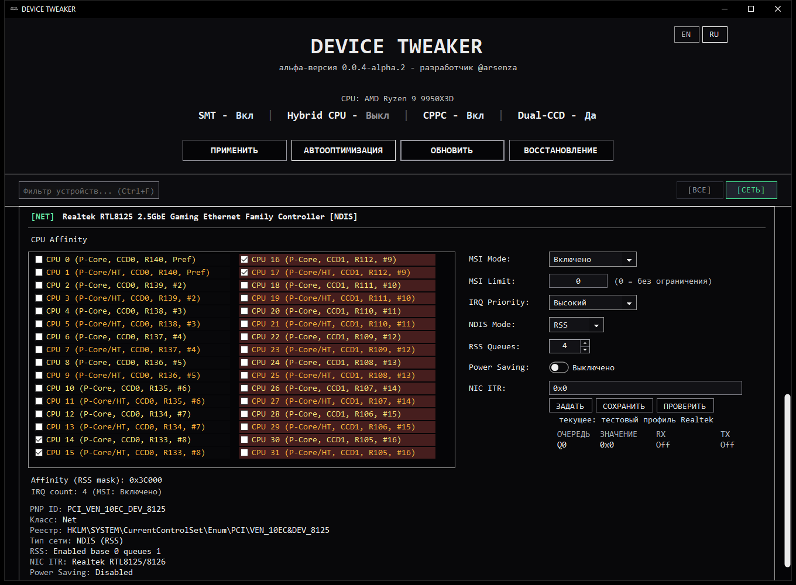
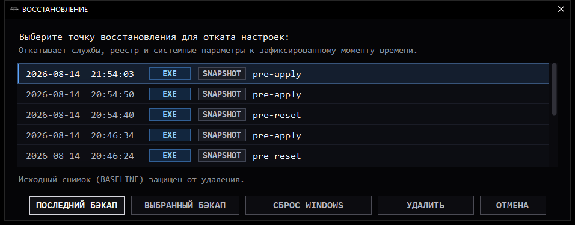

<div align="center">

# DEVICE TWEAKER

[](https://github.com/arsenzaaa/DEVICE-TWEAKER/releases)
[](./LICENSE)
[](https://t.me/arsenzaa)

**Русский** • [English](./README.en.md)

</div>

<p align="center">
  
</p>

## О программе

**DEVICE TWEAKER** - утилита для оптимизации аппаратных прерываний, очередей DPC/ISR и прямого управления задержками оборудования в Windows.

Цель утилиты - устранить системные задержки ввода (input lag) и стабилизировать время кадра (frametime) в соревновательных играх и требовательных задачах. По умолчанию Windows направляет большинство прерываний на CPU 0, не учитывает архитектуру современных процессоров и держит включенной аппаратную модерацию пакетов. DEVICE TWEAKER устраняет эти задержки на системном и аппаратном уровне:

- **MSI / MSI-X:** перевод периферийных устройств в векторный режим прерываний по шине PCIe и снятие реестровых ограничений на количество векторов.
- **CPU Affinity:** распределение очередей DPC/ISR по физическим ядрам процессора: полная разгрузка CPU 0, исключение медленных E-ядер на Intel и закрепление за чиплетом с 3D V-Cache (CCD0) на AMD Ryzen.
- **USB xHCI IMOD:** прямое перепрограммирование физических регистров модерации контроллеров USB через собственный подписанный Ring 0 драйвер (`DTIMOD.sys`) со сбросом задержки до `0 мкс` (Zero Latency) для высокочастотных мышей.
- **Сетевой стек:** отключение аппаратной модерации прерываний сетевой карты (NIC ITR) и настройка очередей Receive Side Scaling (RSS).
- **Изоляция ядер:** системное резервирование ядер через `ReservedCpuSets` для защиты от посторонних фоновых потоков и служб Windows.

**Поддержка:** Windows 10 / Windows 11 (64-bit)

## Возможности

### Аппаратные прерывания MSI / MSI-X

DEVICE TWEAKER переводит периферийные PCIe-устройства из режима устаревших разделяемых линий прерываний (Line-based / INTx) в высокоскоростной векторный режим MSI / MSI-X. В этом режиме прерывание формируется через PCIe Memory Write напрямую в адресное пространство Local APIC целевого ядра (`0xFEE00000`):

- **Включение векторного режима (`MSISupported = 1`):** перевод контроллеров USB, дискретных видеокарт, NVMe-накопителей и сетевых карт в режим MSI для устранения задержек опроса общих линий IRQ.
- **Снятие лимита векторов (`MessageNumberLimit = 0` / Unlocked):** удаление реестрового ограничения векторов, что позволяет шинному драйверу `pci.sys` активировать полный аппаратный пул MSI-X (до 2048 векторов), запрошенный контроллером.
- **Приоритет прерываний HAL (`DevicePriority`):** повышение приоритета обработки очередей критических устройств (ввод мыши, графический конвейер) в системном диспетчере прерываний Windows.

### Маршрутизация очередей по ядрам CPU (Interrupt Affinity)

Штатная политика Windows распределяет очереди DPC/ISR между ядрами без учета гетерогенной или чиплетной топологии современных процессоров. DEVICE TWEAKER настраивает параметр `DevicePolicy = 4` (`IrqPolicySpecifiedProcessors`) и 64-битную битовую маску `AssignmentSetOverride` с учетом архитектуры CPU.

#### Архитектура Intel Core Hybrid (P-Cores vs E-Cores)

На процессорах Intel Core 12-14 поколений и Core Ultra (Alder Lake, Raptor Lake, Arrow Lake) вычислительные ядра разделены на производительные (P-Cores) и энергоэффективные (E-Cores, объединенные в 4-ядерные кластеры с общим кэшем L2).

- **Аппаратная специфика:** исполнение DPC-очередей высокочастотной мыши (1000-8000 Гц), маркеров рендеринга видеокарты или сетевых очередей на медленных E-ядрах приводит к межъядерным задержкам синхронизации и скачкам времени кадра (frametime jitter).
- **Решение в программе:** DEVICE TWEAKER детектирует гибридную компоновку (`Hybrid CPU - Вкл`), разделяет ядра на группы и предоставляет кнопку **`[ Р-ЯДРА ]`** для полного исключения E-ядер и вторичных потоков Hyper-Threading из обработки прерываний.

<p align="center">
  
</p>

#### Архитектура AMD Ryzen Multi-CCD (Dual-CCD / 3D V-Cache)

На многочиплетных процессорах AMD Ryzen (7900X, 7950X, 7950X3D, 9900X, 9950X, 9950X3D) ядра размещены на двух физических кристаллах (CCD0 и CCD1), соединенных шиной Infinity Fabric.

- **Аппаратная специфика:** доступ к локальному кэшу L3 внутри своего кристалла занимает около 20 нс, тогда как межчиплетное обращение через Infinity Fabric добавляет штраф 70-90 нс. На процессорах серии X3D увеличенный кэш 3D V-Cache (96 МБ) физически расположен только на чиплете CCD0.
- **Решение в программе:** DEVICE TWEAKER определяет двухчиплетную структуру (`Dual-CCD - Да`), визуально выделяет ядра CCD1 и по кнопке **`[ CCD0 ]`** фиксирует прерывания критических устройств (мышь, видеокарта) на основном кристалле, удерживая рабочий набор очередей внутри локального кэша L3/3D V-Cache.

<p align="center">
  
</p>

#### Аппаратный кремниевый рейтинг ядер (ACPI CPPC2)

Программа нативно читает аппаратные оценки качества кремния через ядерный трассировщик событий Windows ETW (провайдер `Microsoft-Windows-Kernel-Processor-Power`, Event ID 55, поле `MaximumPerformancePercent`). Опрос занимает менее 60 мс и позволяет точно назначить прерывания мыши на ядро с наивысшим кремниевым потенциалом без использования стороннего софта.

### Аппаратная модерация таймеров USB xHCI (DTIMOD.sys)

По спецификации Intel xHCI Revision 1.2 (§5.5.2), каждый аппаратный интерраптер хост-контроллера оснащен 32-битным регистром `IMOD`. Младшие 16 бит (`IMODI`) задают интервал задержки отправки прерываний с шагом 250 наносекунд. По умолчанию системный драйвер Windows `USBXHCI.SYS` устанавливает задержку 50 мкс (`0xC8`) или 1 мс (`0xFA0`), задерживая прерывания для пакетирования передачи.

- **Отключение модерации (`IMOD = 0` / 0x0):** контроллер формирует прерывание на шину PCIe немедленно по завершении каждого пакета Event TRB, устраняя искусственную задержку буферизации мыши.
- **Драйвер Ring 0 (`DTIMOD.sys`):** выполняет прямое чтение и запись физических регистров MMIO через `MmMapIoSpace`.
- **Разделение контроллеров CHIP 0 / CHIP 1:** модуль `UsbChipPath` анализирует топологию шины PCIe и отличает прямой процессорный контроллер (CHIP 0 / Direct CPU Lanes) от чипсетных хабов (CHIP 1 / PCH). Это позволяет отключить задержку (`0x0`) для мыши на процессорном порту, сохранив стабильный буфер 1 мс (`0xFA0`) для звуковых контроллеров чипсета во избежание щелчков звука.

<p align="center">
  
</p>

В интерактивной таблице DEVICE TWEAKER отображаются физические интерраптеры (IRQ 0..7), текущее активное значение задержки в наносекундах и привязанные конечные устройства. Кнопка **`[ЗАДАТЬ]`** загружает драйвер Ring 0 и записывает регистры MMIO, **`[ПРОВЕРИТЬ]`** подтверждает физическое состояние регистров контроллера, а **`[УДАЛИТЬ]`** возвращает заводское значение драйвера Windows (`0xC8` / 50 мкс).

Для чипсетных контроллеров (CHIP 1+) с подключенными аудиоинтерфейсами и внешними ЦАП устанавливается стабильный аппаратный буфер 1 мс (`0xFA0` / 1000 мкс) с обычным приоритетом IRQ, исключающий щелчки звука и выпадение аудиопотока:

<p align="center">
  
</p>

### Сетевой стек: регистры NIC ITR и масштабирование очередей RSS

- **Прямое программирование физических таймеров сетевых карт:** через драйвер `DTIMOD.sys` программа считывает и изменяет аппаратные регистры задержки прерываний:
  - Intel PCIe (EITR / ITR): I225, I226, I210, I211, I350, I219, 82580, 82576 и Killer E3100 (смещения MMIO `0x1680` и `0x00C4` с шагом кванта 1-2 мкс).
  - Realtek PCIe (IntrMit / IntrMitV2): RTL8111, RTL8168, RTL8125, RTL8126 и Killer E2500/E2600 (регистры `0x00E2` и `0x0A00` с per-queue маской `0x7F7F7F7F`).
- **Receive Side Scaling (RSS):** настройка параметров `*NumRssQueues` и `*RssBaseProcNumber` в ветке драйвера адаптера. Ограничение очередей до 2-4 и смещение базового ядра с CPU 0 предотвращает конкуренцию сетевых DPC-пакетов с конвейером ввода мыши и игровым процессом.
- **Управление электропитанием шины:** отключение энергосберегающих состояний D3 (`PnPCapabilities` бит `0x08`, синхронизированный через WMI `MSPower_DeviceEnable`) и отключение выборочного энергосбережения USB (Selective Suspend).

<p align="center">
  
</p>

DEVICE TWEAKER одновременно настраивает реестровые флаги драйвера NDIS (`*ReceiveBuffers`, `*InterruptModeration`, `*RSS`) и физические регистры аппаратных очередей контроллера через драйвер Ring 0, выводя состояние очередей (Other=Off, IRQ0=Off, IRQ1=Off...) в статусную строку карточки устройства.

На игровых контроллерах Realtek (RTL8125 / RTL8126) программа перепрограммирует регистр модерации `IntrMit` в значение `0x0`, отключая задержку пакетирования прерываний:

<p align="center">
  
</p>

### Системная изоляция ядер (ReservedCpuSets)

Конфигурация системного параметра `[HKLM\SYSTEM\CurrentControlSet\Control\Session Manager\kernel] ReservedCpuSets`. 64-битная маска исключает выбранные логические процессоры из общего пула планировщика потоков Windows (`KiSelectNextThread`). Фоновые службы и непривязанные потоки перестают исполняться на изолированных ядрах, сохраняя исполнительные блоки и кэш L1/L2 под выделенные аппаратные прерывания и потоки с жесткой привязкой (Affinity).

### Фоновый троттлинг ввода (RawMouseThrottleDuration)

Настройка параметра `HKCU\Control Panel\Mouse\RawMouseThrottleDuration` (введен в Windows 11 Build 22621.1928 / KB5028185). Позволяет задать интервал троттлинга сырого ввода (от 1 до 20 мс) для неактивных фоновых окон. Это устраняет паразитную загрузку CPU высокочастотным опросом мыши (1000-8000 Гц) в фоновых приложениях (Discord, OBS, браузер) без влияния на активное игровое окно.

### Контрольные точки и защита системы

- **Неизменяемый исходный снимок:** при первом старте утилита сохраняет полную эталонную конфигурацию Windows (`DeviceTweakerBackup_ORIGINAL.json`) с защитой от перезаписи.
- **Автоматические контрольные точки:** перед каждым применением настроек (кнопка APPLY, сброс или запись IMOD/ITR) создается атомарная точка состояния. При возникновении ошибки записи программа автоматически откатывает изменения.
- **Восстановление в один клик:** возможность отката к последней рабочей точке или полный возврат системы к чистым заводским настройкам Windows.

<p align="center">
  
</p>

## Варианты сборки и запуск

### Системные требования
- **Операционная система:** Windows 10 (сборка 19041 и новее) / Windows 11 (64-bit).
- **Архитектура:** x86-64.
- **Привилегии:** запуск от имени Администратора (требуется для работы с реестром Windows, Local APIC и драйвером Ring 0).

### Варианты исполняемых файлов
- **`DEVICE.TWEAKER.exe`** (~4 МБ) - компактная сборка, требует установленного [.NET 8 Desktop Runtime](https://dotnet.microsoft.com/download/dotnet/8.0).
- **`DEVICE.TWEAKER.SelfContained.exe`** (~150 МБ) - автономная сборка со встроенной средой выполнения .NET 8, готовая к запуску на чистых системах без установки зависимостей.

## Сборка из исходного кода

Для сборки требуется [.NET 8.0 SDK](https://dotnet.microsoft.com/download/dotnet/8.0).

Сборка обеих версий приложения с генерацией манифеста контрольных сумм SHA-256 выполняется командой:

```powershell
powershell -ExecutionPolicy Bypass -File ".\DEVICE TWEAKER\publish-variants.ps1" -Flavor both
```

Скомпилированные файлы и манифест `SHA256SUMS.txt` размещаются в каталоге:
```
.\DEVICE TWEAKER\bin\ReleasePackages\v0.0.4-alpha.2\
```

## Лицензия и контакты

- **Автор:** [@arsenza](https://t.me/arsenzaa)
- **Канал и обратная связь:** [Telegram @arsenzaa](https://t.me/arsenzaa)
- **Лицензия:** [GNU General Public License v3.0](./LICENSE)
