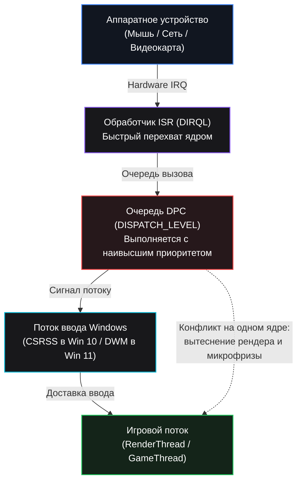

<div align="center">


<br><br>

[](https://github.com/arsenzaaa/DEVICE-TWEAKER/releases)
[](https://github.com/arsenzaaa/DEVICE-TWEAKER)
[](https://github.com/arsenzaaa/DEVICE-TWEAKER)
[](LICENSE)
[](https://t.me/arsenzaa)

<p align="center">
  <b>Русский</b> • <a href="./README.en.md">English</a>
</p>

---

<br>


</div>

<br>

**DEVICE TWEAKER** — утилита для Windows 10 и 11 для комплексной настройки прерываний устройств (MSI), распределения ядер (CPU Affinity), прямого управления модерацией USB (xHCI IMOD) и оптимизации сетевого стека.

Программа объединяет в одном интерфейсе всё, что раньше приходилось настраивать разрозненными утилитами и правками реестра: перевод устройств в режим MSI / MSI-X, снятие лимитов векторов, привязку прерываний к конкретным ядрам с учетом архитектуры процессора, прямое чтение и запись регистров USB IMOD через собственный драйвер `DTIMOD.sys`, настройку очередей сетевой карты (RSS / NIC ITR) и системное резервирование ядер через `ReservedCpuSets`.

---

## Сравнение: Windows по умолчанию vs DEVICE TWEAKER

| Параметр | По умолчанию в Windows | С оптимизацией DEVICE TWEAKER |
| :--- | :--- | :--- |
| **Очередь прерываний** | Сваливается в общую кучу на `CPU 0` вместе с системным таймером и диском | Видеокарта, мышь и сеть разведены по отдельным физическим ядрам без конкуренции |
| **USB IMOD (Модерация)** | Контроллер задерживает прерывания на ~50 мкс, накапливая пакеты пачками | **`0 мкс` (Zero Moderation)** — пакеты мыши передаются в процессор мгновенно |
| **Сетевой стек** | Прерывания сети конкурируют с мышью в общей очереди драйверов `WDF01000.sys` | Выделенные очереди **RSS** на отдельных ядрах и выключенный **`NIC ITR = 0`** |
| **Процессоры AMD X3D** | Прерывания случайно попадают на второй чиплет (CCD1) с задержкой шины Infinity Fabric | Все критические устройства зафиксированы на быстром **CCD0 (3D V-Cache)** |
| **Процессоры Intel Hybrid** | Прерывания могут выполняться на медленных E-ядрах | Полное исключение E-ядер, прерывания закреплены за быстрыми **P-ядрами** |
| **Фоновые службы ОС** | Планировщик Windows раскидывает системные потоки на любые свободные ядра | **`ReservedCpuSets`** защищает выделенные ядра от фонового шума Windows |

---

## Конвейер прерываний и задержек



### Почему без настройки начинаются микрофризы:

- **Вытеснение игрового потока (Preemption):**  
  Очереди DPC выполняются на уровне `DISPATCH_LEVEL`, который выше любого потока игры. Если прерывания мыши с частотой 1000–8000 Гц или сетевой карты обрабатываются на том же ядре, где игра рендерит кадр, поток игры принудительно вытесняется. Итог — микрофризы и рваный фреймтайм.
- **Перегрузка CPU 0:**  
  По умолчанию Windows сбрасывает на нулевое ядро системный таймер, дисковые операции и прерывания большинства устройств. Оставлять там видеокарту или мышь нельзя — они встают в одну общую очередь с системными задачами.
- **Аппаратная задержка USB (xHCI IMOD):**  
  В USB-контроллерах по умолчанию включена модерация прерываний (~50 мкс). Контроллер специально задерживает прерывания и копит пакеты, вместо того чтобы отправлять их сразу. Для мышей с высокой частотой опроса это создает задержку и нестабильность. `DTIMOD.sys` напрямую пишет в физические регистры контроллера и сбрасывает задержку в `0 мкс` (без ожидания).
- **Межчиплетная задержка у AMD (Infinity Fabric):**  
  На процессорах AMD Ryzen с двумя CCD (например, 7950X3D, 9950X3D) игра должна работать на CCD0 с быстрым 3D V-Cache. Если прерывания видеокарты или мыши улетают на второй чиплет (CCD1), данные каждый раз гоняются через шину Infinity Fabric, добавляя 60–80 нс задержки.
- **Медленные E-ядра у Intel:**  
  На процессорах Intel 12–14-го поколений прерывания критических устройств нельзя отдавать энергоэффективным E-ядрам: у них урезанная архитектура и медленный выход из энергосбережения.
- **Конкуренция мыши и сети:**  
  Если сетевая карта и мышь висят на одном ядре, сетевой трафик забивает очередь DPC в `WDF01000.sys`, и пакеты от мыши встают в очередь. Сеть нужно уводить на отдельные ядра через очереди RSS и отключать модерацию сетевой карты (`NIC ITR = 0`).
- **Зачем нужен `ReservedCpuSets`:**  
  Это системный параметр в реестре Windows (`HKLM\...\Session Manager\kernel`), который запрещает планировщику ОС раскидывать фоновые службы и мусорные потоки на выбранные ядра. Мы резервируем ядра, чтобы защитить их от системного шума.

---

## Ключевые возможности

<table>
  <tr>
    <td width="50%" valign="top">
      <h3>⚡ Режим MSI / MSI-X</h3>
      <p>Перевод устройств с устаревших Line-based прерываний на Message Signaled Interrupts, снятие лимита сообщений (<code>MessageNumberLimit</code>) и выставление приоритета <code>IRQ Priority = High</code>.</p>
    </td>
    <td width="50%" valign="top">
      <h3>🎯 Распределение ядер (CPU Affinity)</h3>
      <p>Топологическая привязка к физическим ядрам с учетом пар Hyper-Threading / SMT, разделения чиплетов AMD (CCD0 с 3D V-Cache vs CCD1) и ядер P-Core / E-Core на Intel.</p>
    </td>
  </tr>
  <tr>
    <td width="50%" valign="top">
      <h3>⏱ Прямое управление USB IMOD</h3>
      <p>Сброс модерации xHCI контроллеров в <code>0 мкс</code> (без задержки) через драйвер <code>DTIMOD.sys</code> с дискретностью 250 нс. Индивидуальная настройка интерраптеров для мыши и звука.</p>
    </td>
    <td width="50%" valign="top">
      <h3>🌐 Сетевой стек (RSS и NIC ITR)</h3>
      <p>Разделение очередей сетевой карты по свободным ядрам (<code>*NumRssQueues</code>, <code>*RssBaseProcNumber</code>) и отключение модерации прерываний (<code>NIC ITR = 0 / Off</code> для Intel и Realtek).</p>
    </td>
  </tr>
  <tr>
    <td width="50%" valign="top">
      <h3>🚀 Авто-оптимизация в 1 клик</h3>
      <p>Автоматический расчет идеального распределения: разгрузка <code>CPU 0</code>, разведение мыши и сети по разным ядрам, закрепление GPU за парой смежных P-ядер и фиксация на CCD0 для AMD X3D.</p>
    </td>
    <td width="50%" valign="top">
      <h3>🛡 Безопасность и бекапы</h3>
      <p>Автоматическое создание бекапа перед любым действием, защищенный заводской снимок Windows (<strong>ORIGINAL STATE</strong>), который никогда не перезаписывается, и мгновенный откат при ошибках.</p>
    </td>
  </tr>
</table>

---

<details>
<summary><b>📸 Скриншоты и примеры распределения ядер (нажмите, чтобы развернуть)</b></summary>
<br>

### 1. Распределение ядер: AMD Ryzen Dual-CCD (CCD0 с 3D V-Cache vs CCD1)
<p align="center">
  
</p>

### 2. Распределение ядер: Intel Hybrid (P-Core / E-Core)
<p align="center">
  
</p>

### 3. Таблица прямого управления регистрами USB xHCI IMOD (шаг 250 нс)
<p align="center">
  
</p>

### 4. Окно бекапов и восстановления заводского состояния (ORIGINAL STATE)
<p align="center">
  
</p>

</details>

---

## Поддерживаемое оборудование

| Компонент | Поддерживаемые конфигурации |
| :--- | :--- |
| **Процессоры** | • **AMD Ryzen:** Zen 2 / 3 / 4 / 5 (включая модели с 3D V-Cache: 7800X3D, 7900X3D, 7950X3D, 9800X3D, 9950X3D)<br>• **Intel Core:** 10–14-е поколения (Core i5 / i7 / i9 с гетерогенными ядрами P-Core и E-Core) |
| **Сетевые адаптеры** | • **Intel Ethernet:** I210, I211, I225-V, I225-LM, I225-K, I225-I, I226-V, I226-LM, I350<br>• **Realtek:** PCIe GbE Family Controller, 2.5GbE Gaming Family Controller |
| **USB-контроллеры** | Контроллеры xHCI стандартов USB 3.0 / 3.1 / 3.2 / USB4 (чипсеты AMD B450, B550, X570, B650, X670, X870 и Intel B660, Z690, B760, Z790) |

---

## Как работает драйвер и безопасность

- **Обычное чтение без драйвера:** Кнопка **ОБНОВИТЬ (REFRESH)** опрашивает устройства через стандартные Windows SetupAPI и реестр, драйвер при этом не загружается.
- **Драйвер `DTIMOD.sys`:** Загружается через KDU только тогда, когда вы нажимаете **ПРОВЕРИТЬ (CHECK)** или сохраняете значения IMOD. Драйвер остается в памяти до перезагрузки ПК — это стандартная мера безопасности, чтобы не вызывать синий экран (BSOD) при горячей выгрузке.
- **Перезагрузка:** Параметры прерываний считываются операционной системой при старте устройств, поэтому после нажатия **ПРИМЕНИТЬ** нужно перезагрузить компьютер.
- **Логи:** При каждом запуске программа пишет подробный отчет в папку `logs` рядом с программой.

---

## Варианты сборки и требования

- **ОС:** Windows 10 или Windows 11 (64-bit, все редакции).
- **Варианты программы:**
  - `DEVICE.TWEAKER.exe` (~4 МБ) — стандартная версия, требует установленный [.NET 8 Desktop Runtime](https://dotnet.microsoft.com/download/dotnet/8.0).
  - `DEVICE.TWEAKER.NET.FRAMEWORK.exe` (~150 МБ) — автономная версия со встроенным рантаймом .NET 8 (работает сразу на любой чистой системе без доустановки библиотек).

---

## Сборка из исходного кода

Для сборки необходим [.NET 8.0 SDK](https://dotnet.microsoft.com/download/dotnet/8.0).

Сборка обеих версий приложения с генерацией контрольных сумм SHA-256 выполняется одной командой из корня репозитория:

```powershell
powershell -NoProfile -ExecutionPolicy Bypass -File ".\DEVICE TWEAKER\build.ps1" -Flavor both -Configuration Release -SkipImodDriverBuild
```

Готовые бинарники и хеш-файлы появятся в папке `DEVICE TWEAKER\bin\ReleasePackages\<версия>\`.

---

## Тестирование

В проект входит набор из **21 модульного теста (xUnit)**, проверяющих топологию процессора, события CPPC, битовые маски affinity, формат `ReservedCpuSets` и границы регистров IMOD:

```powershell
dotnet test ".\DEVICE TWEAKER\tests\DeviceTweaker.Tests\DeviceTweaker.Tests.csproj" -c Release -p:BuildImodDriver=false
```

---

## Структура проекта

```
DEVICE-TWEAKER/
├── .gitignore
├── LICENSE
├── README.md                      # Документация (Русский)
├── README.en.md                   # Документация (English)
└── DEVICE TWEAKER/                # Исходный код и ресурсы приложения
    ├── Core/                      # Службы, резервное копирование и логика отката
    ├── Devices/                   # Опрос шин PCI, USB-контроллеров и сетевых карт NDIS
    ├── GUI/                       # Пользовательский интерфейс WinForms и диалоговые окна
    ├── IMOD/                      # Драйвер прямого доступа DTIMOD.sys и библиотека KDU
    ├── Interop/                   # P/Invoke обертки к Win32 API
    ├── Localization/              # Локализация интерфейса (RU / EN)
    ├── Models/                    # Модели данных устройств, топологий и отчетов
    ├── Tweaks/                    # Алгоритмы авто-оптимизации под топологию CPU
    ├── Scripts/                   # Скрипты автоматизации и проверок
    ├── tests/                     # Модульные тесты DeviceTweaker.Tests (xUnit)
    ├── assets/                    # Графические ресурсы, иконки и скриншоты
    ├── docs/                      # Документация и архив релизов
    ├── DeviceTweakerCS.csproj     # Файл проекта .NET 8
    └── build.ps1                  # Скрипт автоматизированной сборки
```

---

## Автор и контакты

- **Автор:** [@arsenzaa](https://t.me/arsenzaa)
- **GitHub:** [arsenzaaa](https://github.com/arsenzaaa)
- **Репозиторий:** [DEVICE-TWEAKER](https://github.com/arsenzaaa/DEVICE-TWEAKER)

## Лицензия

Проект распространяется под лицензией [GNU General Public License v3.0](LICENSE).  
Компоненты KDU в каталоге `IMOD/KDU` распространяются под лицензией MIT.
