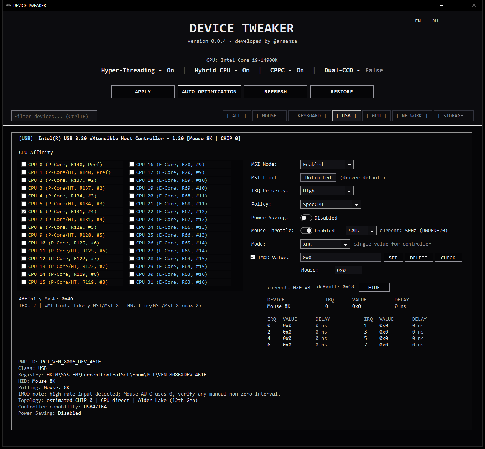

# DEVICE TWEAKER

[Download](https://github.com/arsenzaaa/DEVICE-TWEAKER/releases/tag/v0.0.4) · [Screenshots](./SCREENSHOTS.en.md) · [Changelog](./CHANGELOG.en.md) · [Русский](./README.md) · [My Telegram](https://t.me/arsenzaa)

DEVICE TWEAKER is my Windows 10/11 x64 utility. It brings MSI Mode and Limit, IRQ Priority, Interrupt Affinity, and ReservedCpuSets into one interface, with xHCI IMOD, NIC ITR, RSS, and automatic CPU placement.

## What it does

- Configures MSI Mode, MSI Limit, and IRQ Priority for a selected device. Interrupt Affinity lets you choose which CPUs can handle its interrupts.
- Shows xHCI IMOD values per interrupter. You can configure the whole USB controller or individual interrupters and read the registers back after writing.
- Reads and configures NIC ITR on supported network adapters. RSS controls include queue count, base CPU, and the RSS/IRQ mode.
- Uses P/E cores, SMT/HT, CPPC, and AMD CCD/CCX when placing devices automatically. If a suitable core cannot be chosen reliably, the program skips that device and explains why in the log.
- Estimates mouse and keyboard event rates from Raw Input. RawMouseThrottleDuration controls are available on supported Windows 11 builds.
- Creates backups, restores a selected backup, and reports what was applied, skipped, or failed.

## Download and run

The [current release](https://github.com/arsenzaaa/DEVICE-TWEAKER/releases/tag/v0.0.4) contains two EXEs:

- **DEVICE.TWEAKER.exe** is the smaller build and needs the [.NET 8 Desktop Runtime x64](https://dotnet.microsoft.com/download/dotnet/8.0).
- **DEVICE.TWEAKER.SelfContained.exe** includes the .NET runtime.

Run the program as administrator. Both EXEs include DTIMOD.sys and KDU. SHA256SUMS.txt contains their checksums.

## Interface

The main screenshot shows a USB controller on a simulated Intel Core i9-14900K system with IMOD details expanded. All values are test data; no settings were written to the system.

[More screenshots: AMD IMOD, Intel GPU, and AMD NIC ITR](./SCREENSHOTS.en.md).

## Applying settings

The program creates a backup before the main apply operation, IMOD/ITR writes, and a full reset. Auto-optimization first saves the original settings. If a required backup cannot be created, the write does not begin.

**REFRESH** updates the device list. Use **CHECK** to reread IMOD/ITR values from the hardware. Each result appears in the log.

See [how the settings work](./DEVICE%20TWEAKER/docs/SETTINGS.en.md) for modes, registers, and limits. Build commands are in the [build guide](./DEVICE%20TWEAKER/README.en.md). The source code is licensed under [GPL-3.0](./LICENSE).
