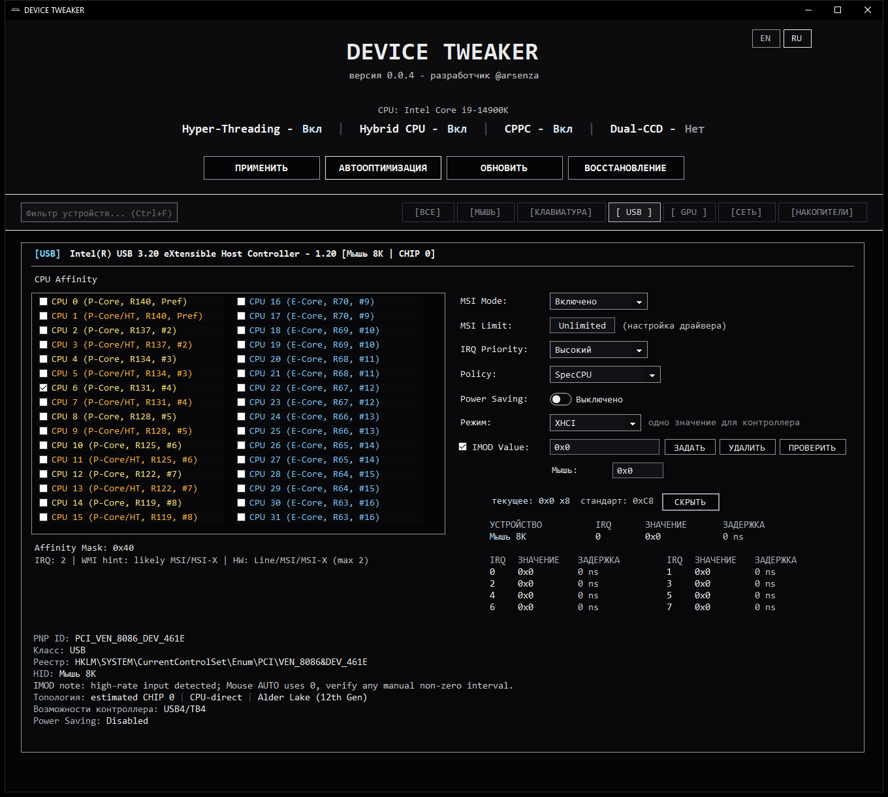

# DEVICE TWEAKER

[Скачать](https://github.com/arsenzaaa/DEVICE-TWEAKER/releases/tag/v0.0.4) · [Скриншоты](./SCREENSHOTS.md) · [История изменений](./CHANGELOG.md) · [English](./README.en.md) · [Мой Telegram](https://t.me/arsenzaa)

DEVICE TWEAKER — моя утилита для Windows 10/11 x64. Я собрал в одном интерфейсе MSI Mode и Limit, IRQ Priority, Interrupt Affinity и ReservedCpuSets, а также добавил управление xHCI IMOD, NIC ITR, RSS и автооптимизацию.

## Что умеет программа

- Настраивает MSI Mode, MSI Limit и IRQ Priority для выбранного устройства. В Interrupt Affinity можно указать, какие CPU будут доступны для его прерываний.
- Работает с xHCI IMOD: показывает значения по interrupter, позволяет настроить весь USB-контроллер или отдельные interrupter и перечитать регистры после записи.
- Читает и настраивает NIC ITR на поддерживаемых сетевых адаптерах. Для RSS доступны число очередей, базовый CPU и выбор режима RSS/IRQ.
- Учитывает P/E-cores, SMT/HT, CPPC и AMD CCD/CCX при автооптимизации. Если для устройства нельзя уверенно выбрать ядро, программа пропускает его и пишет причину в лог.
- Показывает оценку частоты событий мыши и клавиатуры по Raw Input. На поддерживаемых сборках Windows 11 есть настройка RawMouseThrottleDuration.
- Делает резервные копии, восстанавливает выбранную копию и показывает в отчёте, что применилось, что пропущено и почему.

## Скачать и запустить

В [актуальном релизе](https://github.com/arsenzaaa/DEVICE-TWEAKER/releases/tag/v0.0.4) лежат два EXE:

- **DEVICE.TWEAKER.exe** — небольшая сборка. Для запуска нужен [.NET 8 Desktop Runtime x64](https://dotnet.microsoft.com/download/dotnet/8.0).
- **DEVICE.TWEAKER.SelfContained.exe** — автономная сборка со встроенным .NET.

Запускайте программу от имени администратора. Драйвер DTIMOD.sys и загрузчик KDU уже включены в оба EXE. Файл SHA256SUMS.txt содержит контрольные суммы сборок.

## Интерфейс

На главном скриншоте — USB-контроллер в демонстрационной конфигурации с Intel Core i9-14900K. Блок IMOD раскрыт. Все показанные значения тестовые; настройки в систему не записывались.

[Другие скриншоты: IMOD на AMD, GPU на Intel и NIC ITR на AMD](./SCREENSHOTS.md).

## Применение настроек

Перед общим применением, записью IMOD/ITR и сбросом программа создаёт резервную копию. Автооптимизация сначала сохраняет исходные настройки. Если обязательную копию создать не удалось, запись не начнётся.

Кнопка **ОБНОВИТЬ** перечитывает список устройств. Для повторного чтения аппаратных значений IMOD/ITR используйте **ПРОВЕРИТЬ**. Результат каждого действия виден в логе.

Подробности по режимам, регистрам и ограничениям вынесены в [описание настроек](./DEVICE%20TWEAKER/docs/SETTINGS.md). Команды для сборки проекта есть в [руководстве по сборке](./DEVICE%20TWEAKER/README.md). Исходный код распространяется по [GPL-3.0](./LICENSE).
