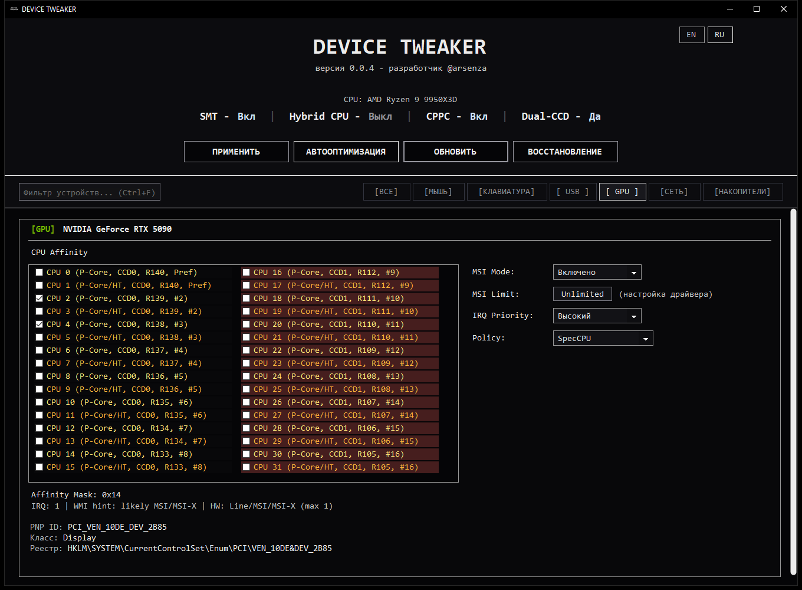

<h1 align="center">DEVICE TWEAKER</h1>

<p align="center">
  <a href="https://github.com/arsenzaaa/DEVICE-TWEAKER/releases/tag/v0.0.4"></a>
  <a href="./README.en.md"></a><br>
  <a href="./CHANGELOG.md"></a>
  <a href="https://t.me/arsenzaa"></a>
</p>

**DEVICE TWEAKER** — утилита для Windows 10/11 x64, объединяющая настройки MSI Utility V3, Interrupt Affinity Policy Tool и ReservedCpuSets с управлением xHCI IMOD, NIC ITR и RSS.

Основные возможности:

- [MSI Mode и MSI Limit](https://learn.microsoft.com/en-us/windows-hardware/drivers/kernel/enabling-message-signaled-interrupts-in-the-registry), [IRQ Priority](https://learn.microsoft.com/en-us/windows-hardware/drivers/ddi/wdm/ne-wdm-_irq_priority) и [Interrupt Affinity](https://learn.microsoft.com/en-us/windows-hardware/drivers/kernel/interrupt-affinity-and-priority): настройка прерываний и выбор допустимых CPU.
- [USB xHCI IMOD](https://cdrdv2-public.intel.com/625472/625472_xHCI_Rev1_2b.pdf): определение подключённых устройств, настройка контроллера или отдельных interrupter и проверка регистров после записи.
- [NIC ITR](https://cdrdv2-public.intel.com/333016/333016%20-%20I210_Datasheet_v_3_7.pdf): чтение аппаратных значений поддерживаемых сетевых адаптеров, настройка очередей и сохранение профиля для следующего входа в Windows.
- [RSS](https://learn.microsoft.com/en-us/windows-hardware/drivers/network/introduction-to-receive-side-scaling): настройка числа очередей и базового CPU; сохранённые параметры и активное состояние адаптера отображаются отдельно.
- [Автооптимизация](#автооптимизация-и-восстановление) с учётом P/E-cores, SMT/HT, CPPC-рейтинга, AMD CCD/CCX и роли каждого устройства.
- [Raw Input](https://learn.microsoft.com/en-us/windows/win32/inputdev/raw-input): оценка частоты событий мыши и клавиатуры. На поддерживаемых сборках Windows 11 доступна настройка [`RawMouseThrottleDuration`](#дополнительные-настройки).
- [Резервные копии и восстановление](#автооптимизация-и-восстановление), подробные логи с результатом применения настроек.

## Скачать и запустить

Актуальная версия — [v0.0.4](https://github.com/arsenzaaa/DEVICE-TWEAKER/releases/tag/v0.0.4). Изменения относительно v0.0.3 перечислены в [истории версий](./CHANGELOG.md).

Доступны два EXE:

- `DEVICE.TWEAKER.exe` — компактная сборка, требует [.NET 8 Desktop Runtime x64](https://dotnet.microsoft.com/download/dotnet/8.0).
- `DEVICE.TWEAKER.SelfContained.exe` — автономная сборка со встроенной средой .NET.

Запускайте EXE от имени администратора. `SHA256SUMS.txt` в релизе содержит контрольные суммы обеих сборок. Для аппаратного чтения и записи IMOD/ITR используются встроенные `DTIMOD.sys` и KDU; если доступ к регистрам недоступен, причина выводится в журнале.

## Интерфейс



На изображениях показаны демонстрационные устройства и настройки без записи в систему: [USB и IMOD](./assets/screenshots/showcase_intel_14900k_full_ru.png), [отдельные interrupter](./assets/screenshots/showcase_amd_imod_full_ru.png), [сеть и NIC ITR](./assets/screenshots/showcase_nic_full_ru.png).

## Прерывания

### MSI / MSI-X

**MSI Mode** записывает `MSISupported` для выбранного устройства. [MSI/MSI-X](https://learn.microsoft.com/en-us/windows-hardware/drivers/kernel/enabling-message-signaled-interrupts-in-the-registry) используют сообщения вместо линии прерывания; MSI-X допускает несколько векторов с разной привязкой к CPU. Наличие MSI-X в контроллере ещё не означает, что драйвер задействовал все векторы. **WMI hint** оценивает режим по выделенным устройству IRQ: число выше 999 трактуется как признак MSI/MSI-X, остальные — как признак Line. Это эвристика, а не проверка типа выданного драйверу interrupt resource; по ней нельзя отличить MSI от MSI-X. **HW** показывает аппаратные возможности, `MSISupported` — настройку в реестре.

**MSI Limit** задаёт `MessageNumberLimit`. **Unlimited** удаляет ограничение из реестра; введённое число проверяется по возможностям MSI/MSI-X, если их удалось определить. **[IRQ Priority](https://learn.microsoft.com/en-us/windows-hardware/drivers/ddi/wdm/ne-wdm-_irq_priority)** задаёт `DevicePriority`: Windows учитывает его при назначении приоритета аппаратному прерыванию. Это не приоритет игры, не приоритет DPC и не гарантия фиксированной задержки.

### Interrupt Affinity

**[Interrupt Affinity](https://learn.microsoft.com/en-us/windows-hardware/drivers/kernel/interrupt-affinity-and-priority)** задаёт логические процессоры, допустимые для IRQ устройства. В выборе видны SMT/HT-потоки, Intel P/E-cores, AMD CCD/CCX и доступный CPPC-рейтинг. Это позволяет выбирать не просто номера CPU, а конкретные физические ядра и их соседние потоки.

Режим **SpecCPU** записывает `DevicePolicy` и `AssignmentSetOverride`. Если снять выбор CPU у обычного устройства, программа записывает `DevicePolicy=0` (`MachineDefault`) и удаляет `AssignmentSetOverride`; для сетевых адаптеров NDIS действует выбранный режим RSS/IRQ. Поддерживается processor group 0, то есть максимум 64 логических процессора. Маска относится к маршрутизации прерываний; драйвер может направить [DPC](https://learn.microsoft.com/en-us/windows-hardware/drivers/kernel/organization-of-dpc-queues) на другой CPU и в случае [MSI-X](https://learn.microsoft.com/en-us/windows-hardware/drivers/network/changing-the-cpu-affinity-of-msi-x-table-entries) изменить привязку векторов во время работы. Фактическое размещение ISR/DPC проверяется трассировкой, а не чтением маски из реестра.

В **Policy** доступны `MachineDefault`, `All`, `AllClose`, `Single`, `SpecCPU` и [`SpreadMessages`](https://learn.microsoft.com/en-us/windows-hardware/drivers/ddi/wdm/ne-wdm-_irq_device_policy). Только `SpecCPU` использует отмеченную в списке маску. Остальные политики передают выбор процессоров Windows; `SpreadMessages` может распределять разные сообщения по разным CPU, если устройство и драйвер используют несколько MSI-X-векторов. Сама политика не создаёт дополнительные векторы.

## USB xHCI IMOD

**[IMOD](https://cdrdv2-public.intel.com/625472/625472_xHCI_Rev1_2b.pdf)** задаёт интервал модерации прерываний xHCI. Регистр принадлежит *interrupter* контроллера с собственным Event Ring, а не отдельной мыши или клавиатуре. Один шаг равен 250 нс: `0xC8` — 50 мкс, `0xFA0` — 1 мс, `0x0` отключает модерацию.

Режим **Устройства** составляет профиль для обнаруженных мышей, клавиатур, геймпадов и USB-аудио и пытается сопоставить их с interrupter по топологии xHCI. При отсутствии надёжной карты применяется общее значение для контроллера. **XHCI** записывает одно значение во все interrupter, **Interrupters** открывает настройку по индексам. В подробностях показываются значения IMOD для первых 64 interrupter.

**ЗАДАТЬ** применяет конфигурацию и проверяет регистры чтением после записи. Пользовательская конфигурация сохраняется для повторного применения при входе в Windows. **ПРОВЕРИТЬ** заново считывает аппаратное состояние; **ОБНОВИТЬ** лишь перечитывает список устройств. **УДАЛИТЬ** убирает общий автозапуск IMOD и сохранённых профилей NIC ITR, устанавливает в интерфейсе значение IMOD программы по умолчанию (`0xC8`) и записывает его в регистры, если драйвер уже загружен. Иначе текущие регистры не меняются; при следующей загрузке их инициализируют Windows и драйвер контроллера. Отдельный автоматический бекап перед **УДАЛИТЬ** не создаётся.

Интервал IMOD не прибавляется к каждому USB-отчёту: событие после простоя interrupter и событие во время активного отсчёта проходят разные пути. Значение регистра и Polling Rate сами по себе не измеряют задержку ввода.

## Сетевые адаптеры

### RSS

**[RSS](https://learn.microsoft.com/en-us/windows-hardware/drivers/network/introduction-to-receive-side-scaling)** распределяет обработку входящих пакетов по CPU с помощью хеша и таблицы перенаправления. **RSS Queues** задаёт запрашиваемое число приёмных очередей, базовый CPU служит отправной точкой для выбора процессоров. **NDIS Mode** позволяет применить RSS, Interrupt Affinity или оба параметра.

Записанный `*NumRssQueues` не равен числу очередей, занятых конкретным трафиком. DEVICE TWEAKER отдельно выводит сохранённые параметры и активное состояние `Get-NetAdapterRss`, а расхождения пишет в лог. Профиль [`NdisRssProfileBalanced`](https://learn.microsoft.com/en-us/windows-hardware/drivers/network/standardized-inf-keywords-for-rss) не предусматривает ручную настройку базового CPU. Адаптер после записи RSS автоматически не перезапускается. RSS управляет приёмом пакетов, Interrupt Affinity — допустимыми CPU для IRQ; эти механизмы не заменяют друг друга.

### NIC ITR

**NIC ITR** работает с аппаратными регистрами модерации поддерживаемых сетевых контроллеров: Intel I210/I211, I219, I225/I226, I350, 82576/82580, Realtek RTL8111/8168, RTL8125/8126 и совместимых Killer. Для неизвестного PCI ID аппаратная запись закрыта.

**ЗАДАТЬ** записывает регистр сейчас, **СОХРАНИТЬ** записывает профиль для применения при следующем входе в Windows, не меняя текущий регистр; **ПРОВЕРИТЬ** перечитывает аппаратное состояние. Формат регистра и единицы интервала зависят от семейства контроллера: число из [EITR Intel](https://cdrdv2-public.intel.com/333016/333016%20-%20I210_Datasheet_v_3_7.pdf) не является готовым профилем Realtek. Более короткий интервал может увеличить число прерываний и нагрузку на CPU.

## Дополнительные настройки

**ReservedCpuSets** задаёт системную маску CPU, которые Windows старается не использовать для обычного планирования. Это не жёсткая изоляция и не замена Interrupt Affinity устройства.

**Power Saving** управляет доступными настройками энергосбережения USB-контроллера и связанных с ним корневых USB-хабов, включая [USB selective suspend](https://learn.microsoft.com/en-us/windows-hardware/drivers/usbcon/usb-selective-suspend). Для проводного сетевого адаптера переключатель меняет разрешение Windows отключать устройство ради экономии энергии. Фактическая доступность этих параметров зависит от драйвера.

На поддерживаемых сборках Windows 11 **Mouse Throttle** меняет `RawMouseThrottleDuration` — интервал ограничения для фоновых обработчиков Raw Input, к которым Windows применяет throttling. Некоторые фоновые регистрации могут обходить это ограничение. Настройка не меняет USB polling rate мыши и не нацелена на активное окно. Программа оценивает частоту по интервалам событий Raw Input и показывает результат рядом с информацией об устройстве; это не прямое измерение частоты USB-опроса.

Кнопки **МЫШЬ**, **КЛАВИАТУРА**, **USB**, **GPU**, **СЕТЬ** и **НАКОПИТЕЛИ** перемещают к соответствующим устройствам в общем списке. Строка поиска скрывает несовпадающие устройства.

## Автооптимизация и восстановление

**АВТООПТИМИЗАЦИЯ** выбирает физические ядра по топологии и CPPC-рейтингу. Для системы с несколькими CCD отдельно выбирается целевой CCD; SMT-потоки одного ядра не считаются двумя независимыми ядрами. GPU планируется на два разных физических ядра, для устройств ввода, проводной сети и аудио действуют свои правила совместного размещения. Если подходящего ядра или надёжно определённой роли нет, назначение пропускается с причиной в отчёте. Если топология CPU определена ненадёжно, запись масок не начинается. Для NDIS автооптимизация подбирает режим RSS/IRQ по обнаруженному состоянию адаптера. IMOD предлагается отдельным шагом, NIC ITR настраивается вручную.

Перед общим ручным применением, записью IMOD/ITR и общим сбросом создаётся проверенная резервная копия. Для автооптимизации обязателен снимок исходных настроек; дополнительный бекап можно создать по желанию. Если обязательный снимок не создан, запись не начинается. Выбрать сохранённый бекап можно в разделе **ВОССТАНОВЛЕНИЕ**.

## Сборка из исходников

Нужны Windows x64 и .NET 8 SDK:

```powershell
dotnet build ".\DEVICE TWEAKER\DeviceTweakerCS.csproj" -c Release
dotnet test ".\DEVICE TWEAKER\tests\DeviceTweaker.Tests\DeviceTweaker.Tests.csproj" -c Release
```

Подробности есть в [руководстве по сборке](./DEVICE%20TWEAKER/README.md). Исходный код распространяется по [GPL-3.0](./LICENSE).
