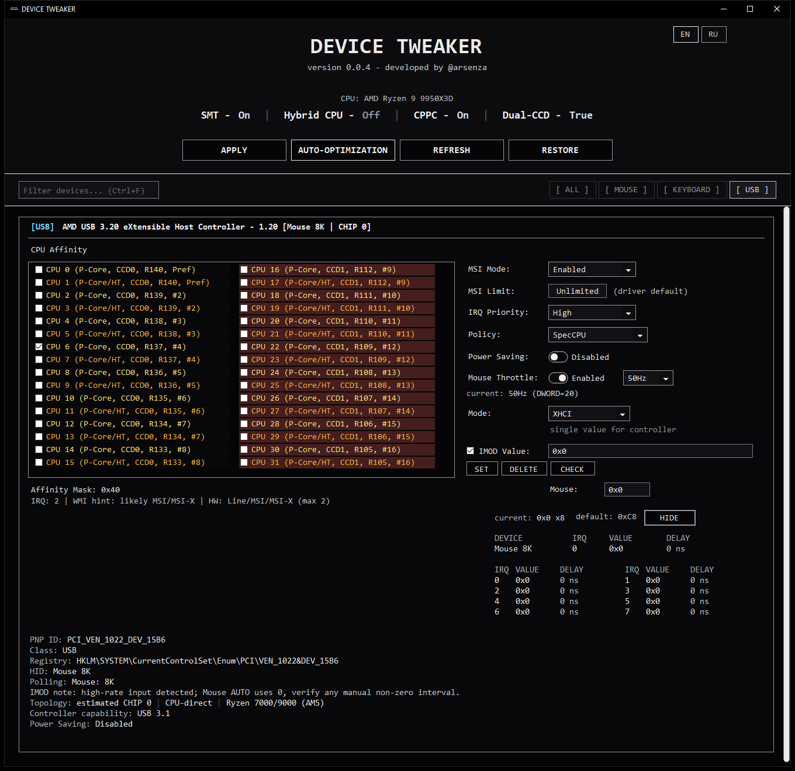
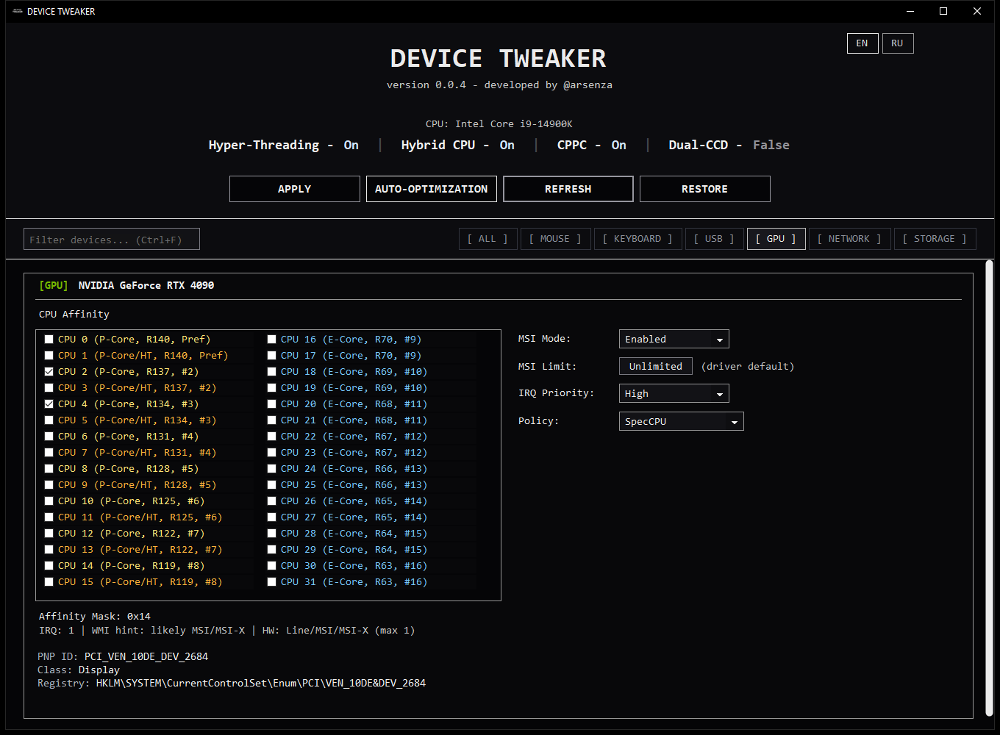
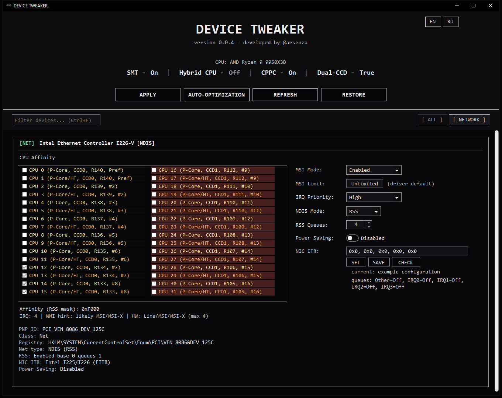

# DEVICE TWEAKER screenshots

[Project overview](./README.en.md) · [Русский](./SCREENSHOTS.md)

These screenshots use simulated devices and test IMOD/ITR values. I did not write any settings to the system while capturing them.

