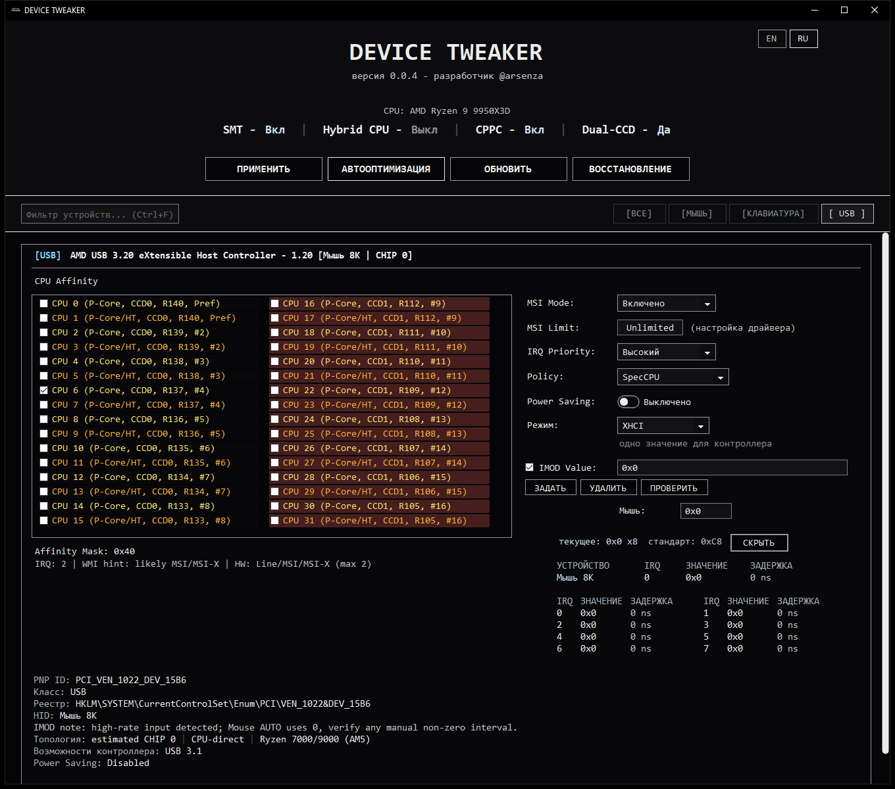
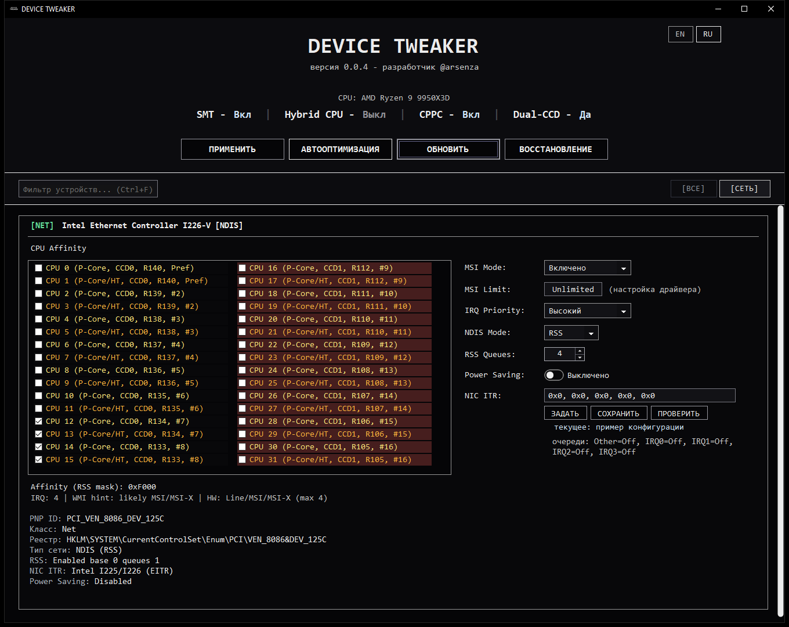

# Скриншоты DEVICE TWEAKER

[Описание проекта](./README.md) · [English](./SCREENSHOTS.en.md)

На изображениях показаны демонстрационные устройства и тестовые значения IMOD/ITR. Настройки в систему не записывались.

